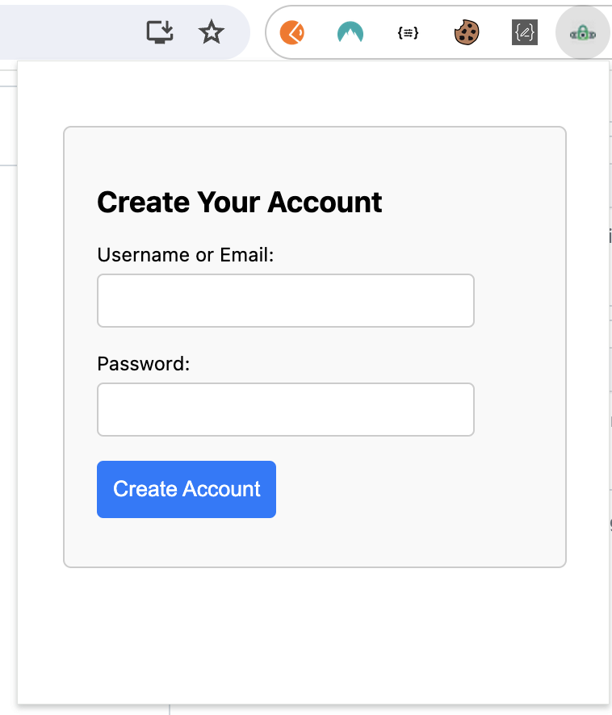
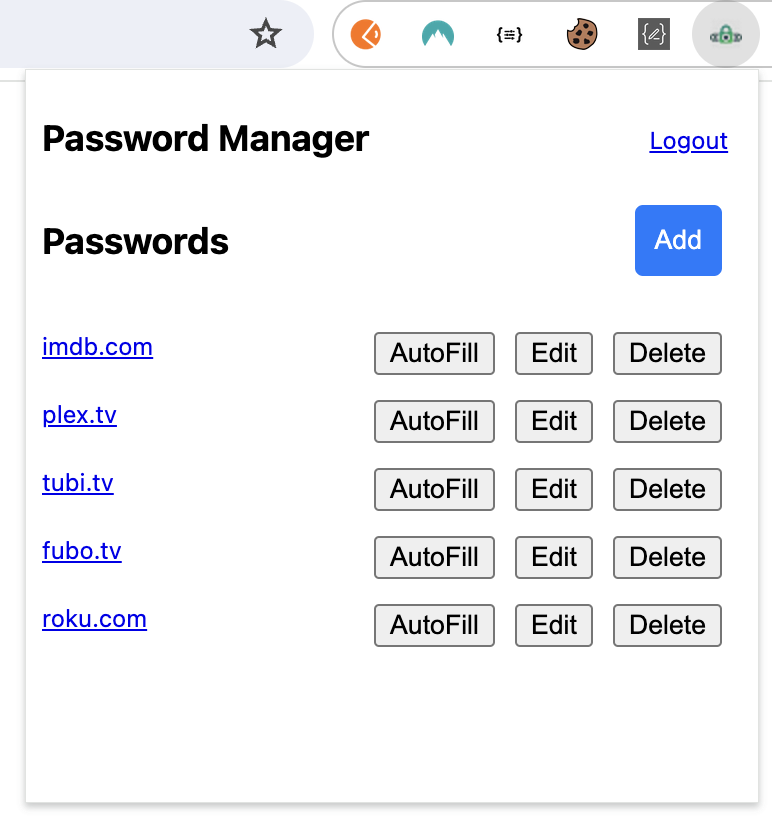
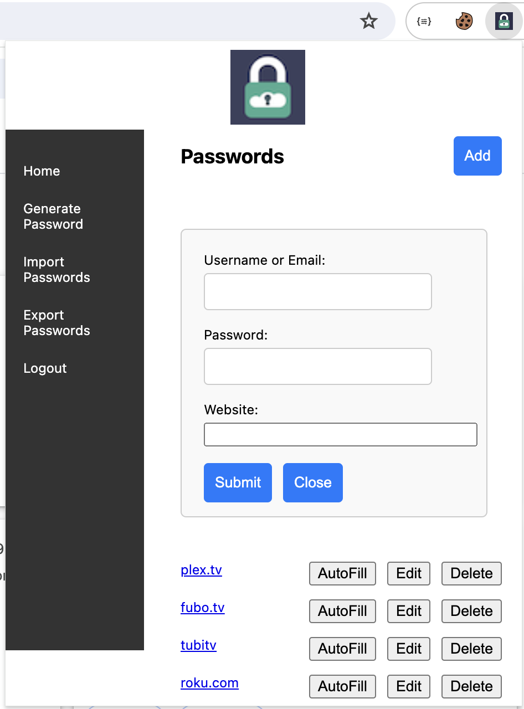
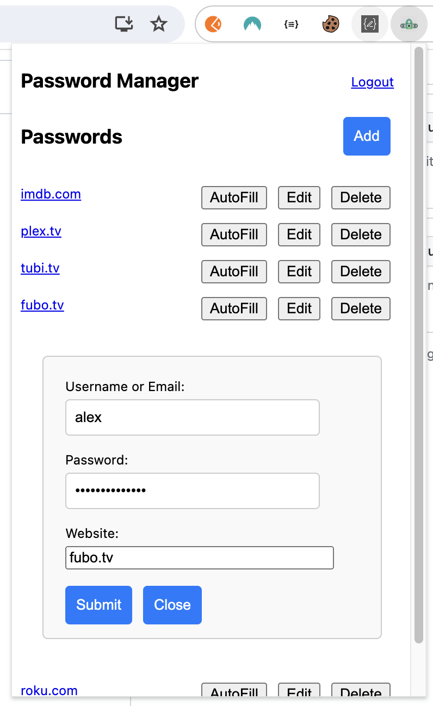

### Password Manager plugin

- Go to chrome:extensions
- Click on Load unpacked
- Select the project folder

### Create Account

### Login

### Display passwords

### Add Password

### Edit Password

